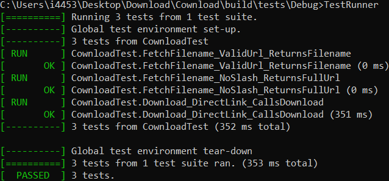

<html>
  <body>
    <div align="center">
      <h1>C++ Implementation</h1>
      <h2>Building</h2>
      <p>You will need <a href="https://git-scm.com">git</a>, <a href="https://cmake.org">CMake</a>, a compiler, and <a href="https://vcpkg.io">vcpkg</a></p>
    </div>
    
```bat
@REM DO THE vcpkg integrate install IF YOU HAVEN'T ALREADY
@REM YOU SHOULD ALSO SET THE `VCPKG_ROOT` ENV VARIABLE THAT POINTS TO THE VCPKG DIRECTORY
vcpkg install boost[boost-filesystem,boost-system] curl gtest
git clone https://github.com/vxbo/Download.git && cd Download && cd Cownload
mkdir build && cd build
cmake .. -DCMAKE_TOOLCHAIN_FILE=%VCPKG_ROOT%/scripts/buildsystems/vcpkg.cmake
cmake --build .
```
  <div align="center">
    <h2>External Libraries</h2>
  </div>
  <p>This project uses the following external libraries:</p>
  <ul>
    <li><a href="https://www.boost.org">Boost</a>: Licensed under the BSL-1.0 License.</li>
    <li><a href="https://curl.se">curl</a>: Licensed under the curlandISCandBSD-3-Clause License.</li>
    <li><a href="https://github.com/google/googletest">Google Test</a>: Licensed under the BSD-3-Clause License.</li>
  </ul>
  <div align="center">
    <p>Please refer to the <code>third_party</code> directory in the project root for the full license texts.</p>
    <hr>
    <h2>Misc</h2>
    
  </div>
  </body>
</html>