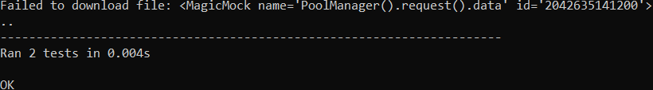

<html>
  <body>
    <div align="center">
      <h1>Python Implementation (I hate this)</h1>
      <h2>Building</h2>
      <p>You will need <a href="https://git-scm.com">git</a> and <a href="https://www.python.org">Python</a> (with pip)</a></p>
    </div>
    
```bat
git clone https://github.com/vxbo/Download.git && cd Download/Pywnload
pip install -r requirements.txt
```
  <div align="center">
    <p>And then use the <code>pywload.py</code> in your code</p>
    <hr>
    <p>To run tests, run the <code>run_tests.cmd</code> or execute</p>
    <br>
    <code>python -m unittest main.py</code>
    <h2>External Libraries</h2>
  </div>
  <p>This project uses the following external libraries:</p>
  <ul>
    <li><a href="https://github.com/urllib3/urllib3">urllib3</a>: Licensed under the MIT License.</li>
  </ul>
  <div align="center">
    <p>Please refer to the <code>third_party</code> directory in the project root for the full license texts.</p>
    <hr>
    <h2>Misc</h2>
    
  </div>
  </body>
</html>